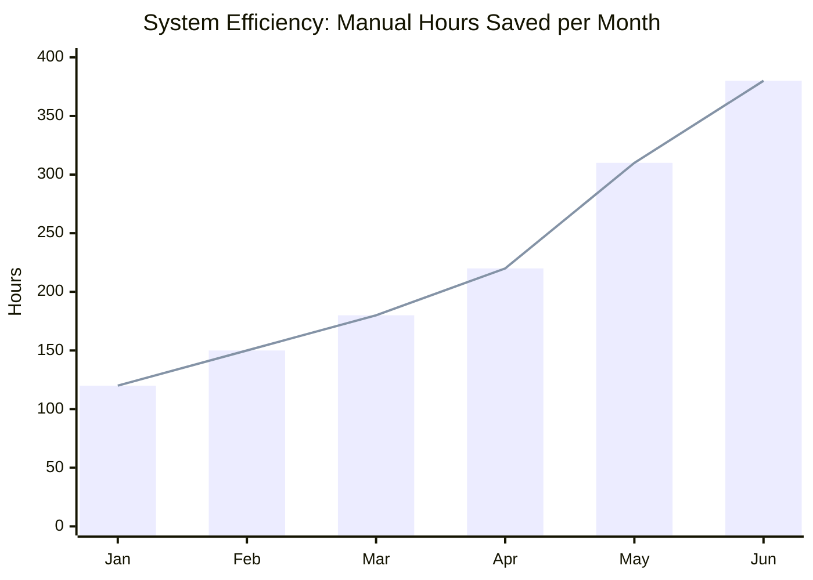
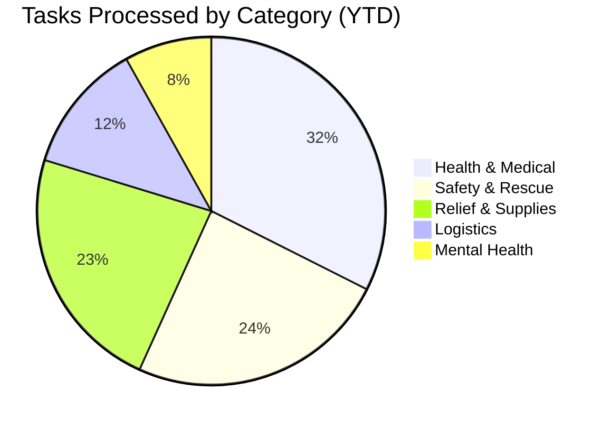

<h1 align="center">
  <br>
  🛡️ NGO AI Command Center & Smart Volunteer Triage
  <br>
</h1>

<p align="center">
  <strong>A full-stack, enterprise-grade platform combining an intelligent multi-agent AI triage engine with a modern incident management dashboard.</strong>
</p>

<p align="center">
  
  
  
  
  
  
  
</p>

---

## 📖 Table of Contents

- [Overview](#-overview)
- [Architecture](#-architecture)
- [Repository Structure](#-repository-structure)
- [Feature Breakdown](#-feature-breakdown)
  - [Incident Command Dashboard](#1-incident-command-dashboard)
  - [AI Intelligence Engine](#2-ai-intelligence-engine)
- [Tech Stack](#-tech-stack)
- [Getting Started](#-getting-started)
  - [Prerequisites](#prerequisites)
  - [Environment Setup](#environment-setup)
- [Environment Variables](#-environment-variables)
- [API Reference](#-api-reference)
- [Project Roadmap](#-project-roadmap)
- [Contributing](#-contributing)
- [License](#-license)

---

## 🌟 Overview

**NGO AI Command Center** is a comprehensive coordination platform designed to modernize disaster response and volunteer triage through autonomous AI agents. It addresses two critical pain points in modern crisis management:

1. **Chaotic Field Reports**: Multi-agent CrewAI pipelines parse completely unstructured, messy incident reports into actionable JSON tasks, translating them and identifying severities instantly.
2. **Inefficient Volunteer Deployment**: A local ChromaDB semantic vector search replaces rigid keyword-matching to find the absolute best volunteers for the job. Proximity-first logic and energy fatigue tracking ensure sustainable, rapid deployments.

Together, these systems form a unified, enterprise-grade response platform capable of scaling up to "Mega-Squads" for mass casualty events.

---

## 🏗️ Architecture

```text
┌─────────────────────────────────────────────────────────────────────┐
│                      NGO COMMAND PLATFORM                           │
│                                                                     │
│  ┌──────────────────────────┐    ┌──────────────────────────────┐   │
│  │    Streamlit Dashboard   │    │     AI Intelligence Engine   │   │
│  │     (Python + Plotly)    │    │ (FastAPI + CrewAI + ChromaDB)│   │
│  │                          │    │                              │   │
│  │  • Report Upload UI      │    │  • Multi-Agent Extraction    │   │
│  │  • Volunteer Roster      │    │  • Semantic Vector Search    │   │
│  │  • Squad Deployment      │◄───┤  • Proximity Scoring         │   │
│  │  • Real-time Analytics   │    │  • Mega-Squad Assembly       │   │
│  │  • System Strain Gauge   │    │  • Energy/Fatigue Tracking   │   │
│  │                          │    │                              │   │
│  └─────────────┬────────────┘    └──────────────┬───────────────┘   │
│                │                                │                   │
│                ▼                                ▼                   │
│         Plotly Analytics              NVIDIA NIM API (Llama 3.1)    │
│         JSON Gamifier DB              Sentence-Transformers         │
└─────────────────────────────────────────────────────────────────────┘
```

---

## 📊 Live Enterprise Analytics

The system automatically generates dynamic ROI and performance metrics. The following are interactive visualizations rendered natively by GitHub mapping to the live Plotly dashboard equivalents:





---

## 📁 Repository Structure

```text
Hackathon Google/
│
├── 📄 README.md                        ← You are here
├── 📄 .gitignore                       ← Unified ignore rules
├── 📄 setup_fedora.sh                  ← Automated Linux setup script
├── 📄 requirements.txt                 ← Python dependencies
│
├── 📂 src/                             ← Core Application
│   ├── 📂 api/                         ← Interfaces
│   │   ├── server.py                   ← FastAPI REST API
│   │   └── dashboard.py                ← Streamlit GUI & Analytics
│   ├── 📂 core/                        ← Business Logic
│   │   ├── engine.py                   ← Pipeline orchestrator
│   │   ├── scorer.py                   ← Severity scoring
│   │   ├── matcher.py                  ← Distance algorithms
│   │   └── gamifier.py                 ← Fatigue & leveling logic
│   └── 📂 nlp/                         ← Advanced AI Models
│       ├── crew.py                     ← CrewAI Agents
│       ├── classifier.py               ← Llama-3.1 interactions
│       └── vector_db.py                ← ChromaDB Storage
│
└── 📂 data/                            ← Persistence
    ├── 📂 vectordb/                    ← ChromaDB SQLite databases
    ├── sample_tasks.json               ← Mock database
    └── volunteer_stats.json            ← Fatigue Persistence
```

---

## 🔥 Feature Breakdown

### 1. Incident Command Dashboard

A dynamic, production-grade interface built with **Streamlit** and styled with a custom dark/gold aesthetic and **Plotly** interactive graphs.

| Module | Description |
|---|---|
| **Mission Control** | Paste chaotic field reports for immediate, one-click AI extraction. |
| **Tactical View** | Live roster of volunteers with their current energy levels and match scores. |
| **Enterprise Analytics** | Interactive Plotly gauge tracking "System Resource Strain", pie charts for task categories, and area graphs for top-unit energy. |
| **Gamified Triage** | Live energy tracking that depletes when volunteers are deployed to prevent burnout. |
| **Auto-Translation** | Instant translations of incident reports into Spanish and French. |

---

### 2. AI Intelligence Engine

A powerful pipeline orchestrated by **CrewAI** and **FastAPI**, running on **Llama-3.1-8b** via NVIDIA NIM.

#### How it works

```text
Chaotic Field Report (Text)
         │
         ▼
 CrewAI Extraction Agents (Llama 3.1)
         │
         ▼
 Clean JSON (Severity, Category, Translation)
         │
         ▼
 Sentence-Transformers Embedding
         │
         ▼
 ChromaDB Semantic Similarity Search
         │
         ▼
 Proximity + Energy Math (Score Penalties)
         │
         ▼
 Squad Assembly (Mega-Squad Split if >40 victims)
```

#### Squad Assembly Logic

| Type | Condition | Logic Executed |
|---|---|---|
| **Standard Squad** | < 40 Victims | Deploys a precision team prioritizing the closest, most energized volunteers via Semantic search. |
| **Mega-Squad** | > 40 Victims | System dynamically splits the response into **Team Alpha** and **Team Beta**, pulling in veteran leadership. |

---

## 🛠️ Tech Stack

### Frontend (Dashboard)
| Technology | Purpose |
|---|---|
| Streamlit | Core UI framework |
| Plotly | Interactive gauges and charts |
| Pandas | Data frame manipulation |

### Backend (AI Engine)
| Technology | Purpose |
|---|---|
| FastAPI | High-performance REST API |
| CrewAI | Multi-agent autonomous orchestration |
| ChromaDB | Vector similarity search |
| Sentence-Transformers | 384-dim text embeddings |
| NVIDIA NIM API | Cloud LLM Inference (Llama 3.1 8b) |

---

## 🚀 Getting Started

### Prerequisites

| Tool | Version |
|---|---|
| Python | ≥ 3.12 |
| Git | Any |

---

### Environment Setup

#### Option A — Automated Linux (Fedora/Ubuntu)
```bash
chmod +x setup_fedora.sh
./setup_fedora.sh
source venv_linux/bin/activate
```

#### Option B — Manual Setup (Windows/Mac)
```powershell
# 1. Create and activate a virtual environment
python -m venv venv
.\venv\Scripts\activate        # Windows
# source venv/bin/activate     # Mac

# 2. Install Python dependencies
pip install -r requirements.txt

# 3. Copy and configure environment variables
copy .env.example .env
# Edit .env with your NVIDIA API key

# 4. Create missing directories
mkdir src\data
```

### Launch the Platform
```powershell
# Terminal 1: Start the Dashboard
streamlit run src/api/dashboard.py

# Terminal 2: Start the REST API
uvicorn src.api.server:app --reload --port 8000
```

---

## 🔐 Environment Variables

Copy `.env.example` to `.env` and configure:

```env
NVIDIA_API_KEY=your_nvidia_api_key_here
```

> **Security:** Never commit your `.env` file. It is excluded by `.gitignore`. Always use `.env.example` as the reference template.

---

## 📡 API Reference

### `POST /process`
Classify a new incident report and receive full triage deployments.

**Request Body:**
```json
{
  "task": {
    "task_id": "T-100",
    "description": "Massive flooding..."
  },
  "volunteers": [
    { "id": "V1", "name": "John Doe", "skills": ["Medical"] }
  ]
}
```

---

## 🗺️ Project Roadmap

- [x] Multi-agent CrewAI extraction pipeline
- [x] Semantic vector matching via ChromaDB
- [x] Streamlit Command Center with Plotly analytics
- [x] Proximity-first logic and Gamified fatigue tracking
- [x] Automated Mega-Squad assembly

---

## 🤝 Contributing

Contributions, issues, and feature requests are welcome!

1. Fork the repository
2. Create your feature branch: `git checkout -b feature/your-feature-name`
3. Commit your changes: `git commit -m 'feat: add some feature'`
4. Push to the branch: `git push origin feature/your-feature-name`
5. Open a Pull Request

---

## 📄 License

This project is licensed under the **MIT License** — see the [LICENSE](LICENSE) file for details.

---

<p align="center">
  Built with ❤️ for better disaster response, faster triage, and smarter NGOs.
</p>
