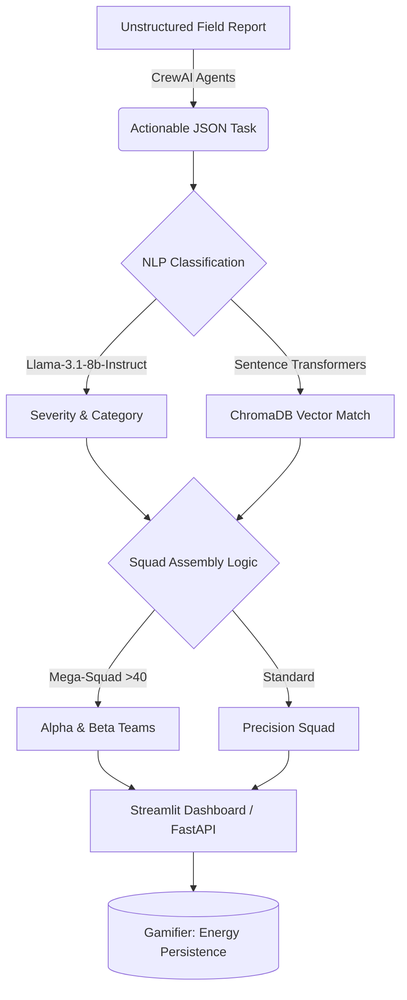
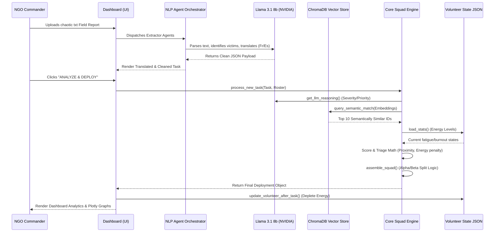
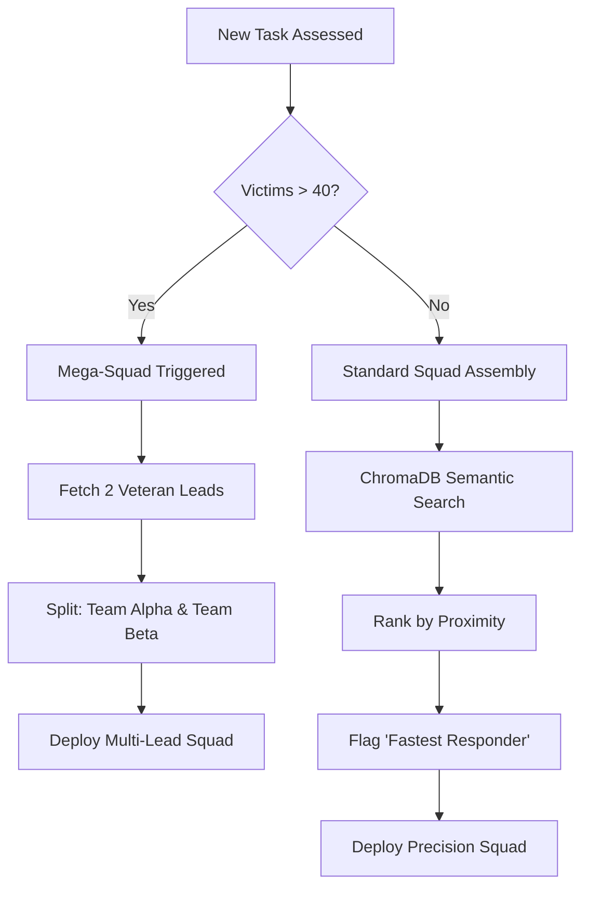
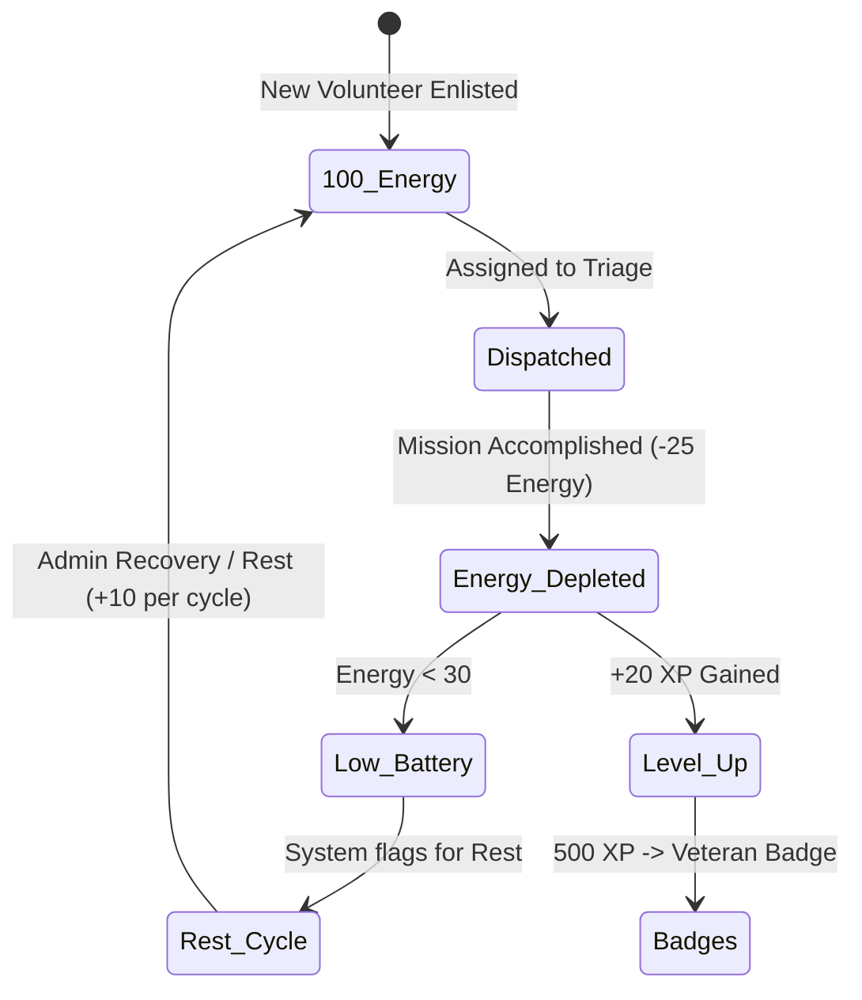

# 🛡️ AI Intelligence Layer: Smart Volunteer Command Center


A powerful, enterprise-grade AI triage and volunteer coordination platform. Built for hackathons and NGOs to dynamically extract actionable disaster relief tasks from unstructured reports, semantically match the best volunteer profiles, and coordinate massive "Mega-Squads" in real-time.

## 🚀 Key Features

- **Multi-Agent Extraction (CrewAI)**: Autonomous agents dynamically parse chaotic incident reports to extract severity, victim counts, and necessary skills.
- **Semantic Vector Matching (ChromaDB)**: Replaces rigid keyword matching by using 384-dimensional semantic embeddings (`all-MiniLM-L6-v2`) to intuitively match volunteers with tasks.
- **Smart Proximity Triage**: Distance-aware algorithms automatically flag "Fastest Responders" for rapid deployment.
- **Mega-Squad Scaling Logic**: Automatically splits large-scale disaster responses (40+ victims) into Alpha and Beta teams with dedicated leadership.
- **Dynamic Resource Strain Analytics**: Interactive `Plotly` dashboard tracking live volunteer energy, utilization metrics, and predictive burnout (Gamified System Load).

## 🗺️ High-Level Architecture



## 🔌 Core API Endpoints (FastAPI)

- `GET /` - System Health Check
- `POST /process` - Main AI Intelligence Endpoint
  - **Payload**: `{"task": {"task_id": "T1", "description": "...", ...}, "volunteers": [{...}]}`
  - **Returns**: Classified priority score, suggested matches, assembled squad, and deep cognitive LLM trace.

## 🏁 Getting Started

### 1. Clone & Setup
```bash
git clone <your-repo-url>
cd project
python -m venv venv
# Windows: venv\Scripts\activate | Mac/Linux: source venv/bin/activate
pip install -r requirements.txt
```
*(Deploying on Fedora/Linux? Just run `./setup_fedora.sh` for an automated build.)*

### 2. Configuration
Copy `.env.example` to `.env` and add your NVIDIA NIM API Key.

### 3. Launch
- **Command Center UI**: `streamlit run src/api/dashboard.py` (Port 8501)
- **REST API**: `uvicorn src.api.server:app --reload --port 8000`

---

# AI Intelligence Layer: Smart Volunteer Coordination 🤖

This repository contains the "Intelligence Layer" for a volunteer management system. It is designed to automate task classification, extract actionable JSONs from chaotic field reports using CrewAI agents, and match the best volunteers using ChromaDB vector semantics and Proximity-First Smart Triage.

---

## 🛠️ Tools & Technologies Used

*   **Python (v3.12.7)**: The core programming language for the intelligence logic.
*   **NVIDIA NIM (Llama-3.1-8B-Instruct)**: Our reasoning engine for task classification and cognitive trace generation.
*   **CrewAI**: Orchestration framework for deploying autonomous agents (Extractors, Translators).
*   **ChromaDB**: Local Persistent Vector Database for semantic matching.
*   **Sentence Transformers (all-MiniLM-L6-v2)**: Generating 384-dimensional semantic embeddings for volunteer skills.
*   **FastAPI**: Backend REST API for high-performance integration.
*   **Streamlit**: Interactive Command Center and mission visualization.
*   **Pandas**: Analytical processing and efficiency metrics.

---

## 📋 Technical Specifications & Requirements

### Core Environment
*   **Python Version**: `3.12.7`
*   **Package Manager**: `pip` (or `poetry` if applicable)
*   **Environment**: Virtual Environment (`venv`) recommended.

### AI Models & Intelligence
| Component | Model Name | Version/Provider | Purpose |
| :--- | :--- | :--- | :--- |
| **Reasoning LLM** | `meta/llama-3.1-8b-instruct` | NVIDIA NIM API | Classification, Triage, Logic |
| **Embedding Model** | `all-MiniLM-L6-v2` | Sentence-Transformers | Semantic Vector Generation |
| **Orchestration** | `CrewAI` | Latest Stable | Multi-agent task extraction |

### Primary Dependencies
*   `fastapi`: Web framework for API.
*   `streamlit`: UI/Dashboard framework.
*   `chromadb`: Vector storage.
*   `requests`: API communications.
*   `pandas`: Data manipulation.
*   `python-dotenv`: Environment variable management.

### 🔑 Secrets & Configuration
> [!WARNING]
> For security, these should normally be stored in a `.env` file. For the hackathon demo purposes, they are listed here for reference:
*   **NVIDIA API Key**: `your_nvidia_api_key_here`
*   **API Base URL**: `https://integrate.api.nvidia.com/v1`

---

## 🧠 Core System Capabilities

*   **Smart Document Extraction**: CrewAI dynamically reads unstructured, chaotic incident reports and extracts severity, actionable steps, and exact victim counts perfectly against chaotic noise.
*   **Multi-Lingual Auto-Translation**: Autonomous agents immediately parse the extracted task into French and Spanish for international responders.
*   **Semantic Vector Matching**: ChromaDB processes the text into vectors and mathematically identifies the absolute best volunteers based on semantic skill correlation, completely removing the limitation of exact keyword checking.
*   **Distance-Aware Smart Triage**: Ranks volunteers using a weighted score that identifies **Fastest Responders** who can arrive before the main squad.
*   **Mega-Squad Scaling**: Automatic tactical splitting into **Team Alpha/Beta** for large-scale incidents (>40 victims) with dedicated Leads.
*   **Volunteer Fatigue & Sustainability**: Live energy tracking (100-0%) and gamified burnout protection.
*   **Enterprise Impact Analytics**: A dynamically updating dashboard showing hours saved, efficiency metrics, and live rosters.

---

## 📂 Project Structure

```text
E:\Hackathon Google\

[ 🟢 ACTIVE / CURRENT CODEBASE ]
├── README.md                 # Master Quickstart & Architecture Overview
├── PROJECT_OVERVIEW.md       # Advanced Technical Deep-Dive
├── workflow_diagram.md       # Mermaid Automated Data Flow Visualizations
├── setup_fedora.sh           # Automated Linux/Fedora Environment Builder
├── src/                      # Source Code (Tiered Architecture)
│   ├── core/                 # Core Business Logic
│   │   ├── engine.py         # AI Pipeline orchestrator & Logic math
│   │   ├── scorer.py         # Priority & Severity scoring logic
│   │   ├── matcher.py        # Ranking & Distance algorithms
│   │   └── gamifier.py       # Fatigue tracking & Leveling logic
│   ├── nlp/                  # 🤖 Advanced AI Models
│   │   ├── crew.py           # CrewAI Agents (Extraction & Translation)
│   │   ├── classifier.py     # Llama-3.1 API interactions
│   │   └── vector_db.py      # ChromaDB Semantic Storage & Transformers
│   └── api/                  # Interfaces & Endpoints
│       ├── server.py         # FastAPI REST Endpoints
│       └── dashboard.py      # Streamlit GUI & Plotly Visualizations
├── data/                     # Data Persistence & DB
│   ├── vectordb/             # Automatically generated ChromaDB SQLite databases
│   ├── sample_tasks.json     # Mock database for tasks
│   └── volunteer_stats.json  # Persistence for Gamification/Fatigue
├── tests/                    # Testing scripts for logic validation
├── test_report.txt           # Sample field report for CrewAI upload testing
├── test_report_extreme.txt   # Highly chaotic stress-test for multi-agent reasoning
└── venv/                     # Project Virtual Environment

[ 🚀 Phase 2 ARCHITECTURE FOLDERS (Upcoming) ]
├── src/integrations/         # Planned: Live External APIs (Google Maps Traffic)
└── models/                   # Planned: Locally hosted Llama model weights
```

---

## 🛠️ Step-by-Step Run Guide

### 1. Requirements & Setup
Ensure you are using the activated virtual environment.
Make sure all dependencies are installed, including the core NLP architectures:
```powershell
pip install fastapi uvicorn streamlit pydantic pandas crewai langchain-openai litellm chromadb sentence-transformers
```

### 2. Launch the AI Dashboard (For Live Demo)
```powershell
streamlit run src/api/dashboard.py
```
*Accessible at: http://127.0.0.1:8501*  
**Test Workflow:** Use the sidebar to upload `test_report_extreme.txt` and click the `🪄 AI Auto-Extract` button to watch the multi-agent pipeline at work.

### 3. Launch the AI API (For Backend Integration)
```powershell
uvicorn src.api.server:app --reload
```
*API Documentation: http://127.0.0.1:8000/docs*

---

## 📈 Project Roadmap & Milestones

### ✅ Completed (Hackathon MVP)
- [x] **Autonomous NGO Report Extraction**: Multi-agent CrewAI pipeline auto-generating actionable JSON tasks directly from uploaded chaotic incident reports.
- [x] **NLP Upgrade (Semantic Matching)**: Upgraded from keyword matching to ChromaDB vector embeddings to seamlessly match complex task descriptions with volunteer profiles dynamically.
- [x] **Multi-lingual Translation**: CrewAI Agents automatically translating live incident reports into Spanish and French.
- [x] **Enterprise Impact Analytics**: Upgraded with interactive **Plotly** data visualizations (Dynamic Resource Strain Gauges, Pie Charts, and Area Graphs).
- [x] **Smart Triage (Proximity-First)**: Real-time calculation using coordinate distance parsing to find Fast Responders.
- [x] **Mega-Squad Logic**: Handlers for high-impact disasters with dual-leadership teams (Team Alpha/Beta).
- [x] **Workload Balancing**: Prevent volunteer burnout via the dynamic Gamification/Fatigue Tracking System.

### 🚀 Phase 2: Enterprise Roadmap (Future Vision beyond MVP)
- [ ] **Interactive "Glow Up" Map**: Live visual deployment tracking (e.g., Folium/Plotly) showing real-time volunteer convergence across the map interface.
- [ ] **Mock Mobile Notifications View**: A simulated UI view demonstrating the volunteer's perspective (e.g., automated WhatsApp hook triggers).
- [ ] **Predictive Forecasting**: Advanced AI to predict regional resource spikes globally based on temporal task trends.
- [ ] **Advanced Model Fine-Tuning**: Train customized LLM models strictly on UN/Red Cross historical NGO data to bypass API reliance entirely.
- [ ] **External API Hazard Integration**: Using live traffic overlays (e.g., Google Maps) to actively re-route responders around damaged infrastructure.

---
**Role:** AI / Smart Logic Developer  
**Status:** MVP Fully Operational | RAG Vector Pipeline Online | Multi-Agent CrewAI Orchestration Online

---

# AI Intelligence Layer: Data Flow & Workflows

This document illustrates the automated data flows, orchestration logic, and agentic loops within the AI Triage System.

## 🔄 Core Triage Pipeline (End-to-End)



## 🧠 Squad Assembly Decision Matrix



## 🔋 Gamified Energy Cycle


