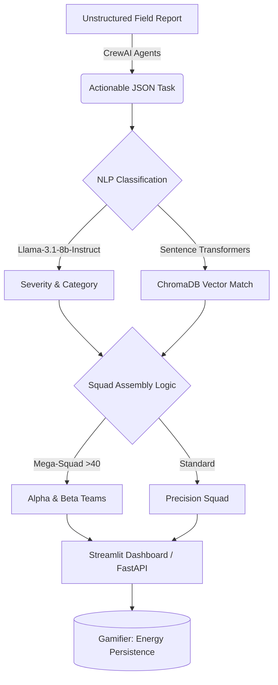

# 🛡️ AI Intelligence Layer: Smart Volunteer Command Center


A powerful, enterprise-grade AI triage and volunteer coordination platform. Built for hackathons and NGOs to dynamically extract actionable disaster relief tasks from unstructured reports, semantically match the best volunteer profiles, and coordinate massive "Mega-Squads" in real-time.

## 🚀 Key Features

- **Multi-Agent Extraction (CrewAI)**: Autonomous agents dynamically parse chaotic incident reports to extract severity, victim counts, and necessary skills.
- **Semantic Vector Matching (ChromaDB)**: Replaces rigid keyword matching by using 384-dimensional semantic embeddings (`all-MiniLM-L6-v2`) to intuitively match volunteers with tasks.
- **Smart Proximity Triage**: Distance-aware algorithms automatically flag "Fastest Responders" for rapid deployment.
- **Mega-Squad Scaling Logic**: Automatically splits large-scale disaster responses (40+ victims) into Alpha and Beta teams with dedicated leadership.
- **Dynamic Resource Strain Analytics**: Interactive `Plotly` dashboard tracking live volunteer energy, utilization metrics, and predictive burnout (Gamified System Load).

## 🗺️ High-Level Architecture



## 🔌 Core API Endpoints (FastAPI)

- `GET /` - System Health Check
- `POST /process` - Main AI Intelligence Endpoint
  - **Payload**: `{"task": {"task_id": "T1", "description": "...", ...}, "volunteers": [{...}]}`
  - **Returns**: Classified priority score, suggested matches, assembled squad, and deep cognitive LLM trace.

## 🏁 Getting Started

### 1. Clone & Setup
```bash
git clone <your-repo-url>
cd project
python -m venv venv
# Windows: venv\Scripts\activate | Mac/Linux: source venv/bin/activate
pip install -r requirements.txt
```
*(Deploying on Fedora/Linux? Just run `./setup_fedora.sh` for an automated build.)*

### 2. Configuration
Copy `.env.example` to `.env` and add your NVIDIA NIM API Key.

### 3. Launch
- **Command Center UI**: `streamlit run src/api/dashboard.py` (Port 8501)
- **REST API**: `uvicorn src.api.server:app --reload --port 8000`

---
*For a deeper architectural dive, please view [PROJECT_OVERVIEW.md](PROJECT_OVERVIEW.md) and [workflow_diagram.md](workflow_diagram.md).*
