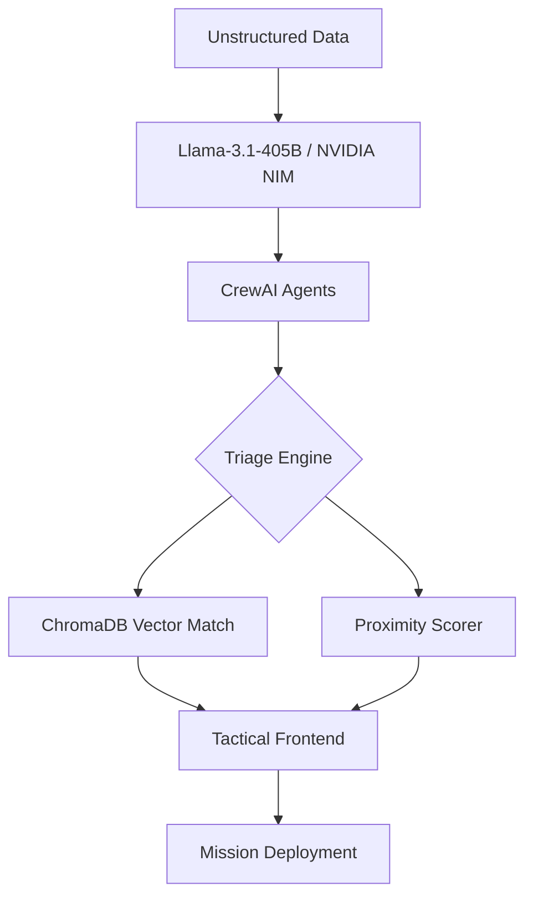

<h1 align="center">
  <br>
  🛰️ NGO AI Tactical Command
  <br>
</h1>

<p align="center">
  <strong>An elite AI-driven coordination platform for real-time disaster response.</strong>
</p>

<p align="center">
  
  
  
  
</p>

---

## 📖 Overview

The **NGO AI Tactical Command System** is a mission-critical platform designed to solve the data-fragmentation crisis in disaster response. By centralizing unstructured field reports, it provides NGO coordinators with a unified "Intelligence Layer" to mobilize resources with surgical precision.

Built with **Llama-3.1-405B-Instruct** (via NVIDIA NIM) and **CrewAI**, the system transforms chaotic text into prioritized missions, matches the best personnel via semantic search, and tracks every deployment on a high-fidelity tactical map.

---

## ✨ Key Pillars

### 🧠 Agentic Intelligence
*   **Autonomous Extraction:** Turns raw incident reports into structured data.
*   **Multi-Agent Pipelines:** Specialized agents for extraction, translation, and triage.
*   **Semantic Matching:** ChromaDB-powered skill matching that understands context over keywords.

### 🗺️ Tactical Command
*   **Geospatial Mapping:** Real-time Leaflet.js tracking with animated rescue routes.
*   **Proximity-First Triage:** Intelligent ranking based on volunteer-to-incident distance.
*   **Squad Scaling:** Automatic logic for handling large-scale incidents (Team Alpha/Beta).

### 🔋 Sustainability & Logistics
*   **Burnout Protection:** Real-time fatigue monitoring and automated energy recovery loops.
*   **Inventory Sync:** Live tracking of "In Use" vs. "Available" equipment.
*   **Gamified Readiness:** XP-based progression for volunteers to maintain high morale.

---

## 🏗️ Architecture


```mermaid
graph TD
    A[Unstructured Data] --> B[Llama-3.1-405B / NVIDIA NIM]
    B --> C[CrewAI Agents]
    C --> D{Triage Engine}
    D --> E[ChromaDB Vector Match]
    D --> F[Proximity Scorer]
    E & F --> G[Tactical Frontend]
    G --> H[Mission Deployment]
```

---

## 🚀 Quick Start

### 1. Setup Environment
```bash
# Clone & Enter
git clone https://github.com/sxrabx/ai-ngo-dashboard.git
cd ai-ngo-dashboard

# Install Core
pip install -r requirements.txt

# Configure Secrets
echo "NVIDIA_API_KEY=your_key_here" > .env
```

### 2. Launch Tactical Center
The system features a custom high-fidelity launcher for orchestrated startup:
```bash
node launch.js
```

*   **Dashboard:** `http://localhost:3000`
*   **Backend API:** `http://localhost:8000`
*   **Documentation:** `http://localhost:8000/docs`

---

## 🛠️ Tech Stack

- **Model**: Llama-3.1-405B-Instruct (via NVIDIA NIM)
- **Framework**: FastAPI (Python 3.12)
- **Intelligence**: CrewAI, ChromaDB, Sentence-Transformers
- **Frontend**: Vanilla JS, CSS3 (Glassmorphism), Leaflet.js, Plotly.js
- **Runtime**: Node.js (Orchestrator)

---

## 📄 License
This project is licensed under the ISC License (as declared in package.json). The frontend package is marked private with no explicit license file — treat all code as proprietary unless otherwise stated by the repository owner.

---

<p align="center">
  Developed for <strong>Mission-Critical Community Response</strong>.
</p>
