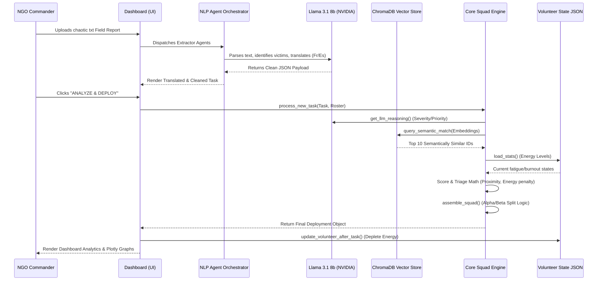
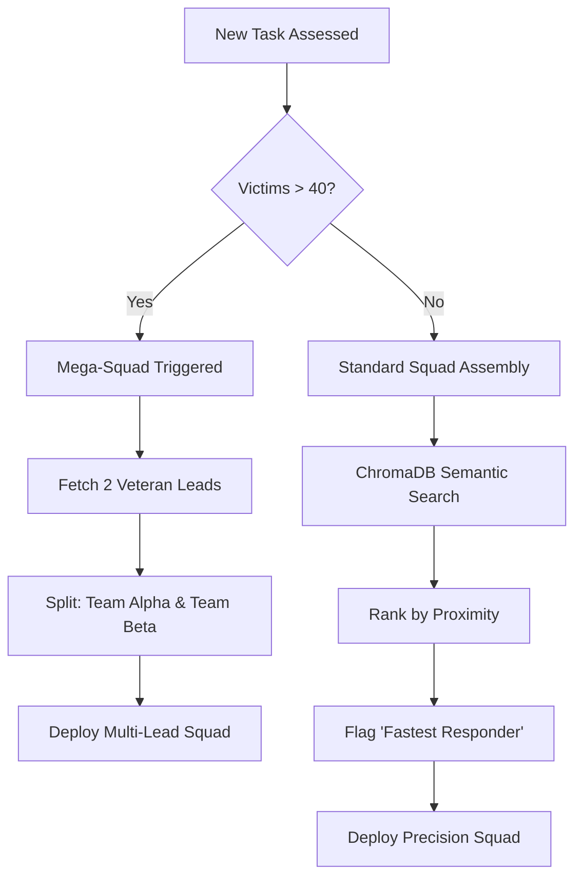
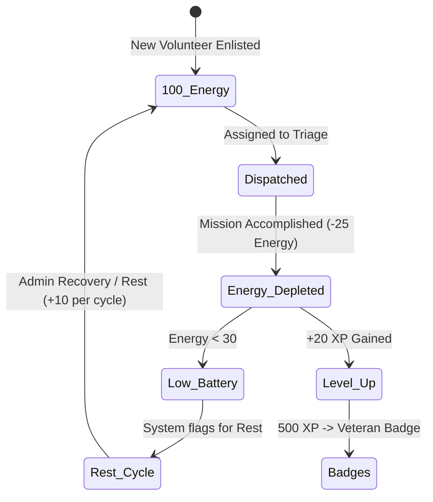

# AI Intelligence Layer: Data Flow & Workflows

This document illustrates the automated data flows, orchestration logic, and agentic loops within the AI Triage System.

## 🔄 Core Triage Pipeline (End-to-End)

## 🧠 Squad Assembly Decision Matrix

## 🔋 Gamified Energy Cycle

